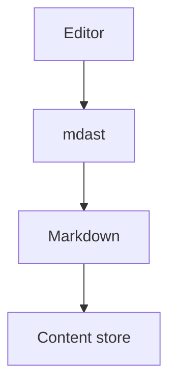

# Fenced code and Mermaid

Source: written for this spike.

A fence with no language:

```
plain text, no highlighting
```

A fence with a language:

```typescript
export function add(a: number, b: number): number {
  return a + b;
}
```

A fence with a language and meta (an info string with more than the language):

```ts title="server.ts" {1,3-4}
const port = 3000;
```

Mermaid is a fenced code block, per ADR-002:



A fence containing something that looks like Markdown:

````markdown
# Not a real heading

```js
const nested = true;
```
````

A fence containing a directive that must not be parsed:

```text
:::wide
this is literal
:::
```
